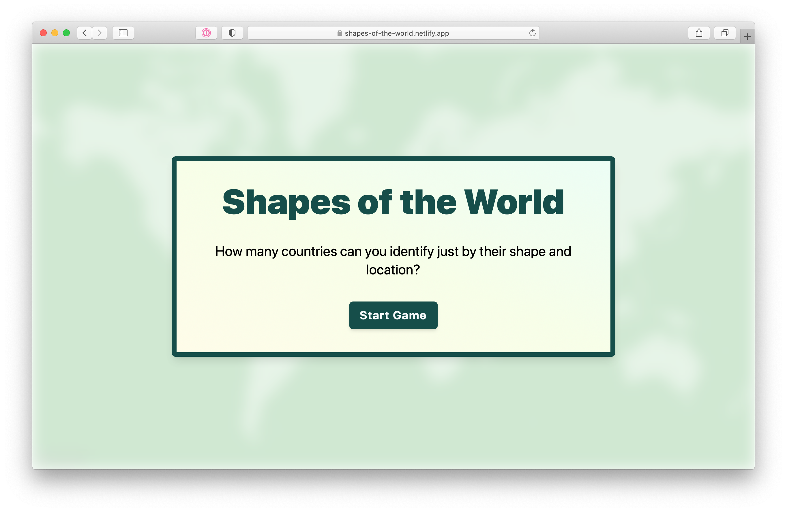

# Shapes of the World

Can you identify all the world's nations just by their geographical shape and location? Find out with this map-based country guessing game for the browser. Built with Svelte.

## [Play the game](https://shapes-of-the-world.netlify.app/)



## Specs
- uses [Mapbox](https://www.mapbox.com/) and [Mapbox GL JS](https://github.com/mapbox/mapbox-gl-js) for map display and interaction
- geographical calculations are done with [Turf.js](https://turfjs.org/)
- geo data is obtained from open sources, but was aggregated and modified for this game
- styled with [Tailwind CSS](https://tailwindcss.com/)
- app written in [Svelte JS](https://svelte.dev/)

## Development

### Setup

```sh
$ npm install
```

You will need a [Mapbox](https://www.mapbox.com/) account and an [access token](https://docs.mapbox.com/help/glossary/access-token/) to run and build the game locally.

Store your public token in an environment variable called `MAPBOX_PUBLIC_TOKEN`.

### Run in watch mode

```sh
$ npm run dev
```

### Debug mode

Append `?debug=true` to the URL to enable debug controls.

### Feature previews

This repository is integrated with Netlify. For each pull request, a deploy preview is created. Once the preview is ready, the Netlify bot will comment the links in your PR.